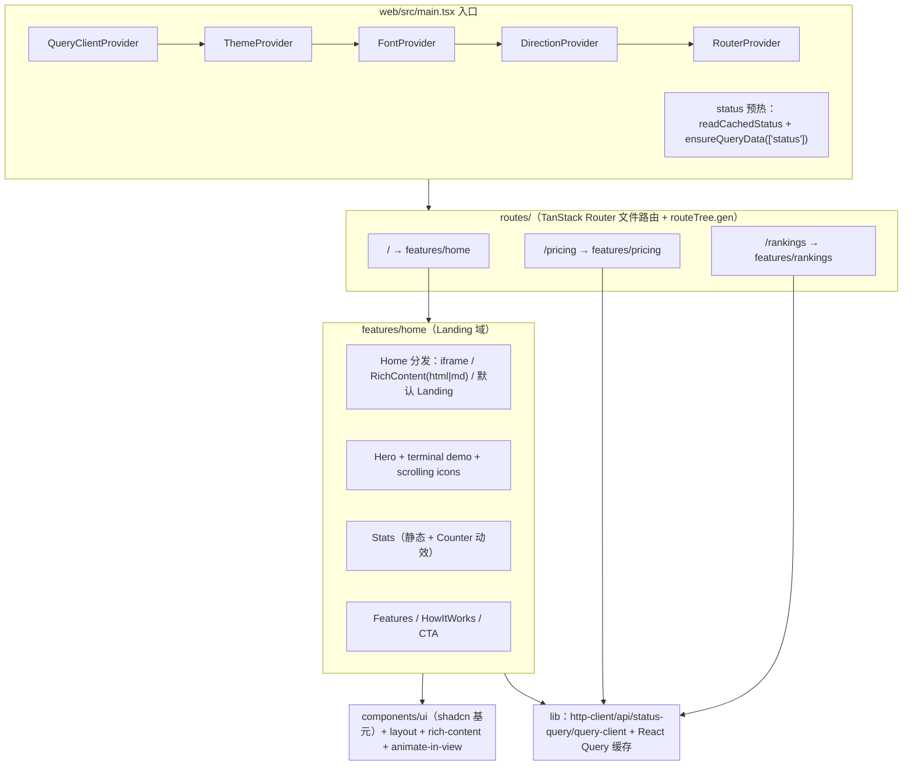

# TECH-听风AI-站点体验与性能优化

> 中文技术文档（Technical Documentation）· 技术实现蓝图
> 对象：**「听风AI」站点体验与性能优化** —— Landing 页（`web/src/features/home`，TanStack Router 路由壳 + features 域组织 + components/ui 基元）+ 首屏性能（Rsbuild 2 分包、React.lazy、Service Worker、字体/元信息）
> 状态：蓝图（未实施）。本文只新增本文件，不改任何代码/配置，不做任何 git 操作。
> 事实基准：2026-09-20 工作区快照（`C:\Users\Administrator.DESKTOP-EGNE9ND\Desktop\公益服务网关\new-api`，fork of QuantumNous/new-api，默认分支 main）。
> 标记约定：✅ 已核实现状（文件/行号可查）｜🆕 计划新增/调整｜⏳ 待验证（未实测，需按步骤确认）。

---

## 目录

1. 架构总览
2. 技术规格
3. API 与接口
4. 安全与合规
5. 实施批次
6. 测试与验收
7. 回滚与发布
8. 待验证清单与治理约束

---

## 1. 架构总览

### 1.1 前端技术栈（✅ 依据 `web/package.json`）

| 类别 | 技术（package.json 版本） |
| --- | --- |
| 框架 | React ^19.2.7 + react-dom ^19.2.7（`StrictMode` 挂载） |
| 构建 | Rsbuild ^2.1.4（Rspack 2 内核）、@rsbuild/plugin-react ^2.1.0、@rsbuild/plugin-tailwindcss ^2.0.3 |
| 路由 | @tanstack/react-router ^1.170.17 + @tanstack/router-plugin ^1.168.19（`routeTree.gen` 文件路由，生产自动按路由分包） |
| 数据 | @tanstack/react-query ^5.101.2（queryClient 全局单例）、axios ^1.18.1、Zustand ^5.0.14 |
| UI | @base-ui/react ^1.6.0（Base UI 基元）+ shadcn 规范（`web/src/components/ui/` 60+ 组件、`shadcn/tailwind.css`）+ Hugeicons + @lobehub/icons + lucide-react |
| 样式 | Tailwind CSS ^4.3.2（CSS-first `@theme`）、tw-animate-css、clsx / tailwind-merge / class-variance-authority |
| 动效 | motion ^12.42.2（✅ 依赖已装；⏳ 当前 `web/src` 未检索到直接 `import ... from 'motion'`，现有落地动效为自研 CSS/IntersectionObserver，见 1.3） |
| 国际化 | i18next ^26.3.4 + react-i18next ^17.0.8 + i18next-browser-languagedetector；7 语言：en（fallback）、zh（zhCN）、zh-TW、fr、ru、ja、vi（✅ `web/src/i18n/locales/` 实有 7 个 `{lang}.json`，另有 `_extras/`、`_reports/`） |
| 图表 | @visactor/vchart ^2.1.2 + react-vchart（另有 recharts 3.9.1，两者并存） |
| 测试/检查 | vitest ^4.1.10（jsdom）、oxlint、tsgo（TypeScript 原生预览编译器，`tsgo -b` 即 typecheck）、knip |
| 包管理 | Bun（`bun install / dev / build / run i18n:sync` 等，见 `web/package.json` scripts） |

后端配合（✅）：Go + Gin + GORM，`router/api-router.go` 挂载 `/api/status`、`/api/home_page_content`、`/api/pricing`、`/api/rankings` 等公开/门控接口（见第 3 章）。

### 1.2 目录分层（features 域组织）

```
web/
├─ index.html                     # 静态 HTML 壳（meta 现状极简，见 2.7）
├─ rsbuild.config.ts              # Rsbuild 2 配置：splitChunks/cacheGroups/代理/分包开关
├─ vitest.config.ts               # jsdom + @ 别名 + src/test-setup.ts
├─ package.json                   # 前端依赖与脚本（bun）
├─ public/                        # logo.png、favicon.ico、pay-*.png、model-test.html …（无 robots.txt/manifest/sw.js）
└─ src/
   ├─ main.tsx                    # 入口：Providers 嵌套 + status 预热 + 构建元信息 + 前端缓存版本
   ├─ routeTree.gen.ts            # TanStack Router 生成路由树（勿手改）
   ├─ routes/                     # 路由壳：/、pricing、rankings、about、setup、_authenticated、oauth、(errors) …
   ├─ features/                   # 业务域：home、pricing、rankings、dashboard、keys、wallet、system-settings …
   │  └─ home/                    # ★ Landing 域（本蓝图主对象）
   │     ├─ index.tsx / api.ts / constants.ts / types.ts
   │     ├─ hooks/use-home-page-content.ts
   │     ├─ components/（sections/{hero,stats,features,how-it-works,cta} + 子组件）
   │     └─ lib/icon-mapper.tsx
   ├─ components/
   │  ├─ ui/                       # shadcn 规范基元：button、card、tabs、table、tooltip、markdown …
   │  ├─ rich-content.tsx / html-content.tsx   # HTML/Markdown 富文本渲染（DOMPurify，见第 4 章）
   │  ├─ animate-in-view.tsx       # IO + prefers-reduced-motion 的入场动画封装
   │  └─ layout/                   # PublicLayout / PublicHeader / Footer …
   ├─ lib/                         # http-client.ts、api.ts、status-query.ts、query-client.ts、colors.ts、theme-*.ts、frontend-cache.ts、build-metadata.ts …
   ├─ context/                     # theme-provider / font-provider / direction-provider / theme-customization-provider
   ├─ hooks/ use-status.ts 等
   ├─ stores/  config/  styles/（index.css、theme.css、theme-presets.css）  i18n/
   └─ test-setup.ts
```

### 1.3 Landing 现状（✅ `web/src/features/home`）

- `routes/index.tsx`：`createFileRoute('/')` → `features/home` 的 `Home`（`web/src/routes/index.tsx`）。
- `features/home/index.tsx`：`Home` 分发逻辑（顺序）：
  1. `useHomePageContent()` 未加载完 → `Loading...` 占位；
  2. 自定义首页为 URL → `iframe`（sandbox 见第 4 章）；
  3. 内容为 HTML → `RichContent mode='html' htmlVariant='isolated'`；
  4. 内容为 Markdown → `RichContent mode='markdown'`；
  5. 为空 → 默认 Landing：`<Hero/><Stats/><Features/><HowItWorks/><CTA/><Footer/>`，外包 `PublicLayout showMainContainer={false}`。
- 组件树（`components/index.ts` 导出 CTA/Features/Hero/HowItWorks/Stats）：
  - `sections/hero.tsx`：渐变标题（clamp 字号）、径向 oklch 渐变背景 + 网格 mask、Badge ping 动效、HeroButtons、文档按钮（`status.docs_link`，默认 `https://github.com/lza6/new-api-Max`）。
  - `components/hero-terminal-demo.tsx`：终端式 API Demo（Chat/Embeddings/Images 多 Tab、请求/响应高亮、latency/tokens 展示）——首屏较重（⏳ 建议懒加载，见批2）。
  - `components/scrolling-icons.tsx` + `icon-card.tsx`：左右双列垂直无缝滚动（`animate-scroll-up/down`，hover 暂停，`lg:` 才显示）。
  - `sections/stats.tsx`：**静态**计数（50+/100+/50+/10+，`Counter` 组件：IntersectionObserver + rAF 缓动，`prefers-reduced-motion` 直接落终值）。
  - `sections/features.tsx` / `how-it-works.tsx` / `cta.tsx`：特性卡片（8 项）、三步流程（AnimateInView）、行动召唤。
- 数据流：`useStatus()`（共享 `/api/status` 缓存）+ `useHomePageContent()`（localStorage 首屏 + ETag 304 后台刷新）；**Landing 默认不请求 pricing/rankings**（那些是独立路由页）。

### 1.4 分层关系图



ASCII 等价图：

```
main.tsx (Providers + status 预热)
   │
   ▼
TanStack Router (routes/* → routeTree.gen)
   ├── /          → features/home   (Landing：Hero/Stats/Features/HowItWorks/CTA 或自定义首页)
   ├── /pricing   → features/pricing (GET /api/pricing)
   ├── /rankings  → features/rankings (GET /api/rankings?period=)
   └── …(about/oauth/setup/_authenticated)
   │
   ▼
components/ui（shadcn 基元） + components/layout + rich-content/html-content + animate-in-view
   │
   ▼
lib/http-client(axios) + lib/status-query + lib/query-client（React Query，'/api/status' 单例去重）
```
---

## 2. 技术规格

### 2.1 Landing 区块结构（✅ 现状 / 🆕 计划）

| 区块 | 现状文件 | 内容 | 首屏权重 | 计划 |
| --- | --- | --- | --- | --- |
| Hero | `components/sections/hero.tsx` | 标题/副标题、Badge、CTA（登录/开始）、Docs 按钮、渐变背景 | 高（首屏可视） | 2xl 大屏版式 + 伪 3D 视觉（见 2.4） |
| 终端演示 | `components/hero-terminal-demo.tsx` | 伪终端 API Demo 轮播 | 中（折叠区） | 🆕 `React.lazy` 懒加载 + `Suspense` 骨架（批2） |
| 应用/模型双列 | `components/scrolling-icons.tsx` + `icon-card.tsx` | 上下无缝滚动图标列 | 中 | 保持 CSS 动画；核对 reduced-motion（已有） |
| Stats | `components/sections/stats.tsx` | 静态 50+/100+/50+/10+ 计数 | 低 | 保持静态（默认不加接口）；若需真实数字走批外后端字段（见 3.3） |
| Features | `components/sections/features.tsx` | 8 张特性卡（AnimateInView） | 低 | 视觉回归基线覆盖 |
| HowItWorks | `components/sections/how-it-works.tsx` | 3 步流程 | 低 | 同左 |
| CTA | `components/sections/cta.tsx` | 注册/文档行动点 | 低 | 同左 |
| 自定义首页分支 | `index.tsx`（iframe / RichContent） | 管理员在后台配置的首页内容 | 不适用 | 保持；安全要求见第 4 章 |

首屏优化原则（🆕）：默认 Landing 不增加任何额外请求；LCP 元素（Hero 标题）纯 CSS/静态；字体、分包、SW 见下文。

### 2.2 设计 token 体系现状（✅）

| Token 层 | 文件 | 事实 |
| --- | --- | --- |
| 语义色/字号 | `web/src/styles/theme.css` | Tailwind 4 `@theme inline`：`--color-background/foreground/primary/muted/destructive/success/chart-*` 映射到 `:root` CSS 变量；`--font-sans`（Public Sans）、`--font-serif`（Lora + CJK 兜底链：Noto/Source Han/Songti/SimSun…）；dark 走 `.dark` 类（`@custom-variant dark`） |
| 预设 | `web/src/styles/theme-presets.css` + `web/src/lib/theme-customization.ts` | `THEME_PRESETS`：default / anthropic / simple-large / underground / rose-garden / lake-view 等；`context/theme-customization-provider.tsx` 驱动 |
| 圆角 | `web/src/lib/theme-radius.ts` | `resolveThemeRadiusPx()` 用 DOM probe 解析 `--radius-md` 等 CSS 变量（`useThemeRadiusPx`） |
| 调色板映射 | `web/src/lib/colors.ts` | `SemanticColor`（17 色）→ bg/avatar/chart 类映射；`CHART_COLORS` 为 HSL 图表色 |
| 主题开关 | `web/src/context/theme-provider.tsx` | 自研（cookie `vite-ui-theme`，1 年）支持 light/dark/system；`next-themes` 在依赖中但未用于 Provider（⏳ 待确认是否被间接使用） |

结论：token 体系已完整。Landing 规划（🆕）：新增落地页专属 CSS 变量（如 `--landing-glow-*`、`--landing-grid-color`）并入 `theme.css`/`theme-presets.css`，把 hero 现有的硬编码 `blue-500`、`emerald-600`、`oklch(...)` 字面量收敛为语义 token，保证 dark 模式与预设切换一致（现状部分为字面量，见 2.4 与第 6 章 rg 命令）。

### 2.3 断点策略（✅ Tailwind 4 默认断点 / 🆕 计划）

| 断点 | 值 | Landing 现状（✅） | 计划（🆕） |
| --- | --- | --- | --- |
| sm | 640px | 移动优先基础布局（单列） | 保持 |
| md | 768px | Hero 内边距加大；Stats `grid-cols-2 → md:grid-cols-4`；终端演示展开 | 保持 |
| lg | 1024px | Hero `grid-cols-1 → lg:grid-cols-12`；滚动图标列 `lg:block`；文案 15px | 保持 |
| xl | 1280px | 无专属类（✅ `rg` 未发现 home 使用 xl） | 可选中间档 |
| 2xl | 1536px | **无任何 2xl 类**（✅ 已核实） | 🆕 批3 新增：容器 `max-w-7xl`/`max-w-[90rem]` 档、Hero clamp 字号上限扩展、区块留白增量 |

实现建议（🆕）：沿用 Tailwind 4 默认断点，不在运行时探测；大屏差异只调间距/字号（clamp 上界），不改变 DOM 结构，避免视觉回归基线分叉。

### 2.4 伪 3D 与 reduced-motion 方案（✅ 现状 / 🆕 计划）

现状（✅）：`web/src/features/home` 无任何 `perspective/rotateX/rotateY/translateZ/preserve-3d`（已核实）；“深度感”来自：
- Hero 径向 oklch 渐变光斑（inline style）+ 网格线 + `mask-image`（`sections/hero.tsx`）；
- `@keyframes appear` 模糊上浮入场、`animate-scroll-up/down` 无缝纵向滚动（`web/src/styles/index.css` 约 330–440 行）。

降级现状（✅，已具备全局能力）：
- `index.css` 两处 `@media (prefers-reduced-motion: reduce)` 全局关闭（约 163、433 行，含 `animation: none !important; opacity:1; transform:none`）；
- `components/animate-in-view.tsx`：JS 侧 `matchMedia('(prefers-reduced-motion: reduce)')` 命中即跳过 IO，直接显示；
- `sections/stats.tsx` 的 `Counter` 同样尊重该媒体查询。

计划（🆕）：
1. Hero 终端卡片 mousemove 倾斜：`rotateX/rotateY` + `transform-style: preserve-3d` + 子层 `translateZ`；仅 `@media (hover: hover) and (pointer: fine)` + `prefers-reduced-motion: no-preference` 下启用；
2. 滚动视差：Hero/Stats 背景层用 CSS `transform: translateY()` 分层（scroll-driven 或轻量 rAF），同样受 reduced-motion 门控；
3. 性能纪律：`will-change` 只加在 ≤3 个关键层；不产生布局抖动；所有新动效必须接入现有全局 kill switch（CSS + JS 双保险）。

### 2.5 分包 cacheGroups 设计（✅ 现状 / 🆕 批1 增补）

现状（✅ `web/rsbuild.config.ts`）：
```ts
splitChunks: {
  preset: 'default',
  cacheGroups: {
    'vendor-react':        { test: /node_modules[\\/](react|react-dom)[\\/]/,  name: 'vendor-react',        chunks: 'all', priority: 0, enforce: true },
    'vendor-ui-primitives':{ test: /node_modules[\\/](@base-ui|@radix-ui)[\\/]/, name: 'vendor-ui-primitives', chunks: 'all', priority: 0, enforce: true },
    'vendor-tanstack':     { test: /node_modules[\\/]@tanstack[\\/]/,          name: 'vendor-tanstack',     chunks: 'all', priority: 0, enforce: true },
  },
},
```
已生效证据（✅ `web/dist/static/js/` 实测产物）：`index.a86c829ec5.js`、`lib-react.064bab1680.js`、`vendor-tanstack.41b48fabbb.js`、`vendor-ui-primitives.3ac43eace1.js`、`9298.7629f8b113.js`（+ 各 `*.LICENSE.txt`，说明 `legalComments` 保持默认 linked，未破坏第三方许可合规）。

计划增补（🆕，批1，仅当对应库被实际打进首页路由）：
```ts
cacheGroups: {
  'vendor-charts':  { test: /node_modules[\\/](@visactor|recharts)[\\/]/,   name: 'vendor-charts',  chunks: 'all', priority: -10, enforce: true },
  'vendor-editor':  { test: /node_modules[\\/]@codemirror[\\/]/,            name: 'vendor-editor',  chunks: 'all', priority: -10, enforce: true },
  'vendor-markdown':{ test: /node_modules[\\/](shiki|marked|katex|stream-markdown-parser)[\\/]/, name: 'vendor-markdown', chunks: 'all', priority: -10, enforce: true },
}
```
原则：只给 >50KB 的重库分组（图表/编辑器/高亮），避免碎片化；优先级低于现有三个 `priority: 0` 分组；稳定分组名 + contenthash 文件名便于 SW 缓存策略（2.6）。⏳ 最终分组需以 `bun run build` 产物体积实测为准（先量后拆）。

### 2.6 Service Worker 设计（🆕 全新引入；✅ 现状：仓库无任何 SW/PWA/workbox 代码与 `webmanifest`）

新增物（批2，全部为 web/ 下新增，不改后端）：
- `web/public/sw.js`（或 `web/sw/sw.ts` 源文件 + rsbuild 插件复制到 dist）；
- `web/src/lib/register-sw.ts`（生产环境 `if ('serviceWorker' in navigator) navigator.serviceWorker.register('/sw.js', { scope: '/' })`，开发环境不注册）；
- `web/public/manifest.webmanifest`（PWA 清单，名称沿用品牌 `new-api-Max`，见第 4 章治理约束）。

缓存策略（🆕）：

| 资源类型 | 特征 | 策略 |
| --- | --- | --- |
| 静态资产 JS/CSS/WOFF2/图片 | 文件名含 contenthash（✅ dist 已证实），不可变 | **Cache-first**（命中即用；miss 走网络并回填） |
| HTML 导航（App Shell） | `index.html` 每版内容固定 | **Network-first**，离线 fallback 到缓存的 index.html 副本 |
| 公开 GET API：`/api/status`、`/api/home_page_content`、`/api/pricing`、`/api/rankings` | 匿名、无鉴权头 | **Network-first**：优先网络（保持 ETag 304 语义），成功后按 URL 回填副本，网络失败才用缓存兜底（首屏离线可用） |
| 带鉴权请求（`Authorization`/`Cookie` 的用户接口、所有非 GET） | 用户态/易变 | **不缓存**（直接透传） |

版本化与回滚（🆕）：
- 缓存名含版本：`newapi:sw:v<major>`，与 `web/src/lib/frontend-cache.ts`（`FRONTEND_CACHE_VERSION='default-v1'`，localStorage 清理）和 `web/src/lib/build-metadata.ts`（`BUILD_CHANNEL_TAG`/`<meta name="build-id">`/`localStorage['app:rev']`）共用同一发布号来源；
- `install` 预缓存核心入口（`index.<hash>.js`、`vendor-react.<hash>.js` 等由构建期注入 `__SW_PRECACHE__` 清单）；`activate` 删除旧版本缓存并 `clients.claim()`；
- 控制台/文档给出 `navigator.serviceWorker.getRegistrations().then(r => r.forEach(x => x.unregister()))` + `caches.keys()` 清理指令作为紧急回滚（见第 7 章）。

### 2.7 index.html 元信息补强清单（✅ 现状 / 🆕 计划）

现状（✅ `web/index.html`，全文仅 26 行）：`lang="en"`、charset、viewport、`google notranslate`、`<title>new-api-Max</title>`、`meta title/description`（"Unified AI API gateway and admin dashboard."）、`theme-color #fff`、favicon `/logo.png`、`<!--umami-->`/`<!--Google Analytics-->` 两个注释占位。**无** OG/Twitter/canonical/robots/manifest/preload/preconnect。

补强清单（🆕，批1 静态部分 + 批2 动态部分）：

| # | 项 | 目标 | 文件 |
| --- | --- | --- | --- |
| 1 | `lang` 动态化 | 语言切换后同步 `document.documentElement.lang`（跟随 i18n，当前静态 en） | `index.html` + i18n 侧小改 |
| 2 | title/description 保留品牌 | 默认 `new-api-Max` 不动（✅ 运行期由 `main.tsx` 用 `system_name` 覆盖 title）；description 扩充为一句产品价值主张 | `index.html` |
| 3 | OG / Twitter Card | `og:title/description/type/url/image`、`twitter:card=summary_large_image`（image 用 `/logo.png`，⏳ 建议后续出 1200×630 OG 图，待设计） | `index.html` |
| 4 | canonical + robots | `<link rel="canonical" href="…">`；新增 `web/public/robots.txt`（`User-agent: *`、`Allow: /`、`Disallow: /api/`、`Disallow: /sign-in` 等） | `index.html` + `public/robots.txt`（新文件） |
| 5 | theme-color 双态 | `media="(prefers-color-scheme: light|dark)"` 两个 `<meta name="theme-color">`（dark 用深色值，替代固定 `#fff`） | `index.html` |
| 6 | 字体预加载 | 字体为自托管 fontsource（✅ `@fontsource-variable/public-sans` / `lora`，经 `web/src/styles/index.css` import 打进构建产物），⏳ 构建后定位 woff2 文件名，对首页主字体 Latin 子集加 `<link rel="preload" as="font" type="font/woff2" crossorigin>` | `index.html`（构建产物名需实测） |
| 7 | manifest | `web/public/manifest.webmanifest`：`name` 沿用品牌、`icons` 用 `/logo.png`、`theme_color`/`background_color`、`start_url: /`、`display: standalone` | 新文件 |
| 8 | umami/GA | 保留两个注释占位；如需启用，脚本经环境变量注入（⏳ 当前无注入逻辑，属独立小改） | `index.html` |
| 9 | CSP | 见第 4 章 4.4（建议服务器/构建期注入，不用内联 meta 硬编码） | 部署层 |

约束：任何补强不得移除/替换 `new-api`、`new-api-Max`、QuantumNous 品牌与版权头（见第 4 章 4.6 与第 8 章）。
---

## 3. API 与接口

### 3.1 接口总览（✅ 全部已有，本蓝图 **无需新增后端接口**）

| 接口 | 方法 | 后端（✅） | 鉴权/门控 | 前端封装（✅ 真实路径） |
| --- | --- | --- | --- | --- |
| `/api/status` | GET | `controller/misc.go:44` `GetStatus`，`router/api-router.go:26`；返回 `success/data`，data 含 `version/start_time/system_name/logo/footer_html/docs_link/theme/currency/全局并发水位(global_concurrency)/模块开关(HeaderNavModules…)` 等开放字段 | 匿名可访问（✅ 路由未挂用户中间件；⏳ 线上是否保持匿名以实测为准，见第 8 章） | `web/src/lib/api.ts` `getStatus()` → `web/src/lib/status-query.ts` `statusQueryOptions`（queryKey `['status']`，staleTime 5min、refetchInterval 5min、gcTime 30min）→ `web/src/hooks/use-status.ts` `useStatus()`（localStorage 快照作 placeholderData） |
| `/api/home_page_content` | GET | `controller/misc.go:213` `GetHomePageContent`（读 `common.OptionMap["HomePageContent"]`，`serveRevalidatedJSON` 输出 ETag/304） | 匿名 | `web/src/features/home/api.ts` `getHomePageContent()`（显式丢弃客户端全局 `Cache-Control: no-store` 以启用 ETag 304）→ `web/src/features/home/hooks/use-home-page-content.ts`（localStorage 缓存 + 后台刷新） |
| `/api/pricing` | GET | `controller/pricing.go:38` `GetPricing`（按可用分组过滤 pricing + groupRatio）；`router/api-router.go:36` 挂 `middleware.HeaderNavModuleAuth("pricing")` | 模块门控：模块关闭 → 403；`RequireAuth` → 需登录（`middleware/header_nav.go:104`） | `web/src/features/pricing/api.ts` `getPricing()` → `web/src/features/pricing/hooks/use-pricing-data.ts` `usePricingData()`（queryKey `['pricing']`，staleTime 5min，依赖 `useStatus().status.price` 做汇率兜底） |
| `/api/rankings?period=week` | GET | `controller/rankings.go:10` `GetRankings` → `service/rankings.go:138` `GetRankingsSnapshot`（5min TTL 缓存，返回 models/vendors/top_movers/top_droppers/history/share 系列）；`router/api-router.go:43` 挂 `HeaderNavModuleAuth("rankings")` | 同上（模块门控） | `web/src/features/rankings/api.ts` `getRankings(period)` → `web/src/features/rankings/hooks/use-rankings.ts` `useRankings()`（queryKey `['rankings', period]`，staleTime 5min） |

### 3.2 请求层事实（✅）

- 全局 axios 实例：`web/src/lib/http-client.ts` —— `baseURL: ''`、`withCredentials: true`、默认头 `Cache-Control: no-cache, no-store`；GET 并发去重（in-flight map）；401 走 `refreshAuthentication()` 重试；`web/src/lib/api.ts` 统一导出 `api` 与业务方法。
- React Query 全局：`web/src/lib/query-client.ts` `createAppQueryClient()` —— 默认 `staleTime: 10s`、`refetchOnWindowFocus: false`、失败重试规则（DEV 或 >3 次不再重试，401/403 不重试）、QueryCache/MutationCache 全局错误提示；`main.tsx` 用它预热 `['status']`。
- 前端缓存版本：`web/src/lib/frontend-cache.ts` —— `FRONTEND_CACHE_VERSION='default-v1'` + localStorage 白名单（user/uid/aff/oauth:binding:result），版本变更清空 UI 缓存（SW 版本机制可与之共用发布号）。

### 3.3 本特性数据源结论与建议

- ✅ Landing 默认所需：仅 `/api/status`（Hero 的 `system_name/logo/docs_link`、登录态按钮）+ `/api/home_page_content`（自定义首页开关）。**首屏不应依赖 pricing/rankings**。
- ✅ `/api/pricing`、`/api/rankings` 只属于 `/pricing`、`/rankings` 独立路由页（已有完整 features 域），本蓝图只优化其加载（分包/懒加载/缓存参数），不改变其契约。
- 🆕 可选（默认不做）：若 Landing Stats 要展示“真实模型数/通道数”，需后端在 `GetStatus` 增加字段——⏳ 已核实当前 `GetStatus` 返回字段**无**模型数/通道数；属于批外后端改动，需另立需求。
- 🆕 建议新增（纯前端、批2）：`web/src/lib/landing-query.ts` 聚合 `useLandingData()`（组合 `useStatus` + `useHomePageContent`，统一 loading/error 状态）便于懒加载与 SW 预取；不新增网络请求数。
---

## 4. 安全与合规

### 4.1 DOM 消毒（✅ 现状完整，计划保持并回归）

| 层 | 文件（✅） | 行为 |
| --- | --- | --- |
| HTML 富文本 | `web/src/components/html-content.tsx` | `DOMPurify.sanitize(content, isolatedSanitizeOptions)`；`hardenIsolatedHtml()` 追加加固：iframe 强制 `sandbox`（`isolatedContentSandbox`）+ `referrerpolicy="no-referrer"` + 默认 `loading="lazy"` + 移除 `srcdoc`；`a[target=_blank]` 强制 `rel="noopener noreferrer"` |
| Markdown 渲染 | `web/src/components/ui/markdown.tsx` | `marked` 解析 → `DOMPurify.sanitize(parsedHtml, sanitizeOptions)`（dompurify 版本被 `overrides` 锁 3.4.13） |
| 统一入口 | `web/src/components/rich-content.tsx` | `RichContent`（mode html/markdown、htmlVariant isolated）是自定义首页/公告/法律页的唯一渲染入口 |

计划（🆕）：上述消毒路径全部保留；新增视觉回归用例把“自定义首页 HTML 内含 `<script>`/`onerror`/iframe 无 sandbox”作为负例断言（DOM 中不含可执行脚本、iframe 必带 sandbox）。

### 4.2 iframe sandbox（✅ 现状）

- 自定义首页 URL 分支（`web/src/features/home/index.tsx:88`）：
  `sandbox="allow-forms allow-popups allow-popups-to-escape-sandbox allow-scripts allow-top-navigation-by-user-activation"`（**不含** `allow-same-origin`，保持同源隔离；`allow-top-navigation-by-user-activation` 是管理员配置的受信 URL 主动授权，注释已说明理由）。
- 其他：`features/about/index.tsx:156`（无 same-origin）、`components/ai-elements/web-preview.tsx:215`（含 `allow-same-origin`，属受限 AI 预览场景）、`routes/model-test.tsx:60`（`allow-scripts`）。
- 计划（🆕）：`allow-top-navigation-by-user-activation` 维持现状即可（管理员受信源）；`postMessage`（`index.tsx` 的 `syncIframePreferences` 主题/语言同步）维持 `*` 目标但只发非敏感枚举值；不新增对第三方 origin 的信任。

### 4.3 密钥不进前端（✅ 原则 + 现状）

- 现状：`web/src/lib/http-client.ts`/`auth-session` 只短期持有会话/access token（内存 + 受控 localStorage），无硬编码密钥；`/api/status` 中的 `github_client_id`、`oidc_client_id`、`turnstile_site_key` 均为**公开 client id/站点 key（非密钥）**，Landing 不得把它们当密钥处理。
- 计划（🆕）：批2 的 SW/预取不得缓存或记录任何带 `Authorization` 头或用户态 Cookie 的响应；新增代码禁止 import 后端密钥、禁止把密钥写入 `web/public` 或 bundle（可加 `rg -n "sk-|secret|token\\s*=\\s*['\\\"]" web/src/features/home` 自查命令）。

### 4.4 CSP 建议（🆕 部署层，不在本文件强制实施）

- 现状：`web/index.html` 无 CSP meta；⏳ 服务器响应头是否已设 CSP 需实测（curl -I）。
- 建议：生产用 `Content-Security-Policy` 响应头而非内联 meta：`default-src 'self'`；`script-src 'self'`（如需 umami/GA 再追加其域名；禁用内联脚本，`build-metadata` 已设计为 CSP 剥离后仍可观测）；`style-src 'self' 'unsafe-inline'`（Tailwind/动态样式需要）；`connect-src 'self'`（+umami/GA 上报域名）；`img-src 'self' data:`；`frame-src 'self' <管理员可配置的 iframe 域名>`（自定义首页/About 预览）；批2 引入 SW 后需 `worker-src 'self'`；`object-src 'none'`；`base-uri 'self'`。⏳ 落地前需与线上部署（nginx/docker 镜像）核对注入方式。

### 4.5 OWASP / 无障碍要求

- 本蓝图不触碰认证流程（登录/注册/2FA 均不在范围内），因此 OWASP ASVS 认证章节不适用；但涉及**用户/管理员输入渲染**（HomePageContent）与公开页面可访问性，适用以下要求：
  - 输入渲染：见 4.1/4.2（DOMPurify + sandbox 服务端/客户端双重边界；前端消毒不替代后端管理端权限校验——后端 OptionMap 仅管理员可写，✅ 现状即如此）。
  - 无障碍（WCAG 2.1 AA，参照 `web/AGENTS.md` 3.12）：语义化标题层级（Hero 唯一 `h1`）；按钮/链接可键盘操作（复用 `components/ui/button`）；装饰元素 `aria-hidden`（✅ hero 渐变/网格已加）；`focus-visible` 样式随主题 token；**动效必须尊重 `prefers-reduced-motion`**（✅ 全局 CSS kill switch + `AnimateInView` + `Counter` 已有，批2/批3 新动效必须沿用）；⏳ Landing 渐变文字（blue/violet 深底）对比度需 Lighthouse/axe 实测补足。
- 性能预算属于工程约束：SW 只做同源缓存、不做跨域代理；预取仅在 `defaultPreload: 'intent'`（✅ `main.tsx`）与链接可见时触发，避免无谓流量。

### 4.6 i18n 全语言（✅ 机制 + 🆕 要求）

- 机制：`web/src/i18n/config.ts` 加载 7 语言（en/zhCN/zh/zh-TW/fr/ru/ja/vi），`fallbackLng: 'en'`、`nsSeparator: false`、浏览器检测 localStorage→navigator；`web/package.json` 提供 `bun run i18n:sync`（`scripts/sync-i18n.mjs`）与 `web/src/i18n/static-keys.ts` 登记机制。
- 要求（🆕）：Landing 新增/改动的一切面向用户文案必须走 `t('English key')`，并同步补齐 7 份 locale 文件 + `static-keys.ts`；禁止把英文硬编码回 `constants.ts`（✅ 现状 `features/home/constants.ts` 已用 `t()` 包装，属合规模式）；验收跑 `bun run i18n:sync` 且 7 语言 diff 无缺失键。

### 4.7 品牌保护（✅ 强制约束，蓝图遵守）

- `new-api` / `new-api-Max` / QuantumNous 的标识、版权头（`Copyright (C) 2023-2026 QuantumNous`）、模块路径（`github.com/lza6/new-api-Max`）、包名（`newapi-web`）、`index.html` 默认 `<title>new-api-Max</title>`、许可证/README 引用一律**不得移除/替换/重命名**。
- 本蓝图内：`index.html` 元信息补强为**追加**性质；`manifest.webmanifest` 的 `name` 沿用品牌；Hero 默认文档链接保持 `https://github.com/lza6/new-api-Max`；任何“听风AI”品牌定制只允许作为运行期 `system_name` 配置覆盖（✅ `main.tsx` 现有机制），不作为代码内替换。
---

## 5. 实施批次

> 原则：批1 纯配置/静态，无行为风险；批2 引入 SW 与懒加载；批3 视觉基线 + 大屏。每批独立可验证、可回滚（见第 7 章）。**本文档只描述各批计划，不代为实现。**

### 5.1 批1 —— 配置级 quick wins（低风险）

| 改动点 | 文件范围（🆕） | 内容 | 风险 |
| --- | --- | --- | --- |
| 分包 cacheGroups 增补 | `web/rsbuild.config.ts` | 见 2.5：按实际产物体积增补 `vendor-charts/vendor-editor/vendor-markdown`（先量后拆） | 低：只影响 chunk 命名/体积分布；分组过多会碎片化，需比对 dist 体积 |
| index.html 元信息 | `web/index.html`、新增 `web/public/robots.txt` | 见 2.7 的 #1–#5、#8（OG/Twitter/canonical/robots/theme-color 双态；umami/GA 占位保持） | 低：纯 HTML/meta；注意不替换品牌 title |
| query-client 参数核对 | `web/src/lib/query-client.ts` | 保持默认 `staleTime:10s` 不变；为公开只读查询（status/home/pricing/rankings）统一文档化缓存语义（各 feature 已各自设 5min stale）；如需 Landing 聚合，新增 `web/src/lib/landing-query.ts` 且沿用 `['status']` 单例 | 低：不改请求契约；只微调缓存/去重 |
| （可选）字体预加载 | `web/index.html` | 构建后定位 woff2 产物名，对首页主字体 Latin 子集加 `preload`（⏳ 依赖批1 构建产物实测） | 低 |

批1 验证命令：`cd web && bun run build`（产物无报错、dist 出现预期 cacheGroup 命名）；`bun run typecheck`；`bun run lint`；浏览器手工看 `/` 首屏 meta 预览（DevTools → Network/头部）。

### 5.2 批2 —— SW + 懒加载 + SEO（中风险）

| 改动点 | 文件范围（🆕） | 内容 | 风险 |
| --- | --- | --- | --- |
| Service Worker | 新增 `web/public/sw.js`（或 `web/sw/sw.ts` + rsbuild 复制插件）、`web/src/lib/register-sw.ts`、`main.tsx` 生产环境注册；`install/activate/fetch` 三事件按 2.6 策略；**缓存名带发布版本**，复用 `build-metadata` 的 `app:rev` | 离线壳 + 哈希静态缓存优先 + 公开 API 网络优先 | 中：缓存旧资源/API 兜底行为需回归；版本号写错会导致旧缓存长期驻留 → 依赖第 7 章版本回滚预案 |
| 懒加载 | `web/src/features/home/components/hero-terminal-demo.tsx`（`React.lazy` + `Suspense` 骨架）；确认 TanStack Router 生产 `autoCodeSplitting`（✅ `rsbuild.config.ts` `tools.rspack.plugins[tanstackRouter({ autoCodeSplitting: isProd })]`，开发环境关闭避免白闪） | 首屏仅必要 chunk；折叠区按需加载 | 低-中：懒加载边界错误会闪白 → 用骨架/占位；`build:check` 兜底 |
| SEO/元信息动态部分 | `web/src/routes/index.tsx` + `web/src/features/home/index.tsx`（路由级 `document.title`：`${system_name}` + 品牌后缀，保留默认品牌）；`web/public/manifest.webmanifest`（新增） | 见 2.7 #2/#6/#7 | 低 |
| 请求层 | 新增 `web/src/lib/landing-query.ts`（可选聚合 hook，不新增请求数） | 统一 loading/error | 低 |

批2 验证命令：`cd web && bun run build && bun run typecheck && bun run lint && bun run test`；本地 `bun run preview`（localhost 属安全上下文，可注册 SW）→ DevTools Application/Service Workers 检查预缓存与策略命中；Lighthouse（见第 6 章）。

### 5.3 批3 —— 视觉回归基线 + 大屏 2xl（中风险）

| 改动点 | 文件范围（🆕） | 内容 | 风险 |
| --- | --- | --- | --- |
| 视觉回归基线 | 新增 `web/e2e/`（`playwright.config.ts` + screenshot 脚本）、`web/package.json` 增加 devDependency `@playwright/test`（⏳ 当前仓库无任何 playwright 配置，需新增安装） | 桌面 1440 / 笔记本 1280 / 平板 768 / 手机 375，Light+Dark 各一套截图入库；后续改动 diff | 中：首次基线需人工逐张确认；浏览器二进制下载体积大 |
| 大屏 2xl | `web/src/features/home/components/sections/*` + `components/hero-terminal-demo.tsx` 等（见 2.3/2.4） | 2xl 容器/字号/留白档 + 伪 3D 增强（mousemove 倾斜、滚动视差，reduced-motion 全关） | 中：版式分叉 → 以截图基线为准验收 |

批3 验证命令：`cd web && bunx playwright test --update-snapshots`（生成基线）→ 后续 `bunx playwright test`；`bun run typecheck && bun run lint && bun run test && bun run build`；`rg` 硬编码色/断点统计（见第 6 章）。

### 5.4 批次依赖与门禁

- 顺序：批1 → 批2 → 批3；批2 依赖批1 的分包名（SW 预缓存清单按实际 chunk 名生成）；批3 依赖批2 的懒加载边界（截图前先稳定 DOM）。
- 每批门禁（AGENTS.md）：改动 TS/TSX 必须过 `bun run typecheck`；涉及 i18n 必须 `bun run i18n:sync`；组件改动必须复核 `web/AGENTS.md` 3.3 组件复用规则与 3.13 安全规则；不改 docs/（本文件在 `计划书/`，非 docs/）；不触碰品牌标识。
---

## 6. 测试与验收

### 6.1 命令级验收（✅ 脚本与配置已核实）

在 `web/` 目录执行：

| 项 | 命令（✅ package.json scripts） | 验收标准 |
| --- | --- | --- |
| 生产构建 | `bun run build`（= `rsbuild build`） | 退出码 0；dist 内出现稳定的 vendor 分组与 contenthash 文件名；无 minify/legalComments 告警 |
| 类型检查 | `bun run typecheck`（= `tsgo -b`）；组合 `bun run build:check` | 0 error |
| Lint | `bun run lint`（oxlint，配置 `.oxlintrc.json`） | 0 error（warning 按变更范围评估） |
| 单元/组件测试 | `bun run test`（vitest run，jsdom，`web/vitest.config.ts`：`@` 别名、`src/test-setup.ts`、include `src/**/*.{test,spec}.{ts,tsx}`） | 全部通过；Landing 相关新增用例（负例见 4.1） |
| i18n | `bun run i18n:sync`（`scripts/sync-i18n.mjs`） | 7 语言键同步无缺失；新增文案已进 `static-keys.ts` |
| 未用依赖 | `bun run knip` | 无把计划中已用依赖标为未用的误报（供参考） |

### 6.2 数据/静态扫描命令（✅ 可立即执行）

```bash
# 1) Landing 与样式内硬编码颜色统计（规划把字面量收敛进 token 后，此列表应显著缩短）
rg -n -i "#[0-9a-f]{3,8}\b|rgb\(|rgba\(|oklch\(" web/src/features/home web/src/styles

# 2) 断点使用分布（当前应无 xl/2xl；批3 后 2xl 出现且集中在 home）
rg -o "\b(sm|md|lg|xl|2xl):" web/src/features/home -g "*.tsx" | Group-Object | Sort-Object Name

# 3) Landing 内疑似硬编码英文文案（启发式，需人工复核；合规态应全部经 t()）
rg -n ">[A-Za-z][A-Za-z ]{3,}<" web/src/features/home -g "*.tsx"

# 4) 疑似把密钥/令牌写进前端的自检（批2 门禁）
rg -n -i "sk-[a-z0-9]{16,}|api[_-]?key\s*[:=]\s*['\"]" web/src/features/home web/public 2>$null
```

### 6.3 性能验收（CWV / Lighthouse）

- 本地基线：`bun run preview` 后 `npx lighthouse http://localhost:3000 --preset=desktop --view`（及移动档 `--preset=desktop` 外可另测 throttling）；目标（🆕 建议值，⏳ 需先采集现状基线再定死）：移动 4G 模拟下 LCP < 2.5s、CLS < 0.1、TBT < 300ms。
- 线上（⏳ 需用户授权执行，非破坏性只读检查）：对用户自有站点 `https://freeapi.tingfengai.art`（**来源：本机会话记忆 2026-09-19 部署审计，可能已漂移，须先复核**）跑 Lighthouse/curl 基线；该站点为香港 2C2G/5Mbps 小带宽，首屏优化收益主要来自静态资源体积与缓存命中（SW/分包/字体）。
- 每批验收记录：LCP/FCP/CLS 前后对比 + dist 总体积与各 chunk 体积表（`Get-ChildItem web/dist/static/js | Sort-Object Length`）。

### 6.4 视觉与行为验收（批3）

- Playwright 截图：桌面 1440 / 笔记本 1280 / 平板 768 / 手机 375，Light + Dark 共 8 张基线（新增 `web/e2e/`，⏳ 仓库当前无 playwright 配置，需新增依赖与浏览器）。
- 手工回归清单：自定义首页三态（iframe URL / HTML / Markdown）不受优化影响；语言切换（含 zh-TW 等 RTL 无关语言）后 Landing 全量文案与 `lang` 同步；`prefers-reduced-motion: reduce` 下动效全关且内容可达（Lighthouse/axe 抽查对比度）。

---

## 7. 回滚与发布

### 7.1 文档批（本次交付）

- 交付物：仅 `计划书/TECH-听风AI-站点体验与性能优化.md` 一个文件（UTF-8）。本任务不执行任何 git 操作；后续由主控/用户自行 `git add` 该文件并提交（提交信息建议 `docs(web): 听风AI 站点体验与性能优化技术蓝图`）。
- 回滚：删除该文件即可，零风险（不触碰任何代码/配置/品牌）。

### 7.2 代码批发布建议

- 每批独立提交（禁止 `-f`/force 推送；遵守项目 Git 约定：先 fetch 目标分支、按主题拆 commit、push 后核对远端 SHA）。
- Tag 建议：批1 完成打 `web-perf-v1`（或随版本号 `v1.2.x-web-perf1`，以仓库现有 tag 风格为准，⏳ 需先 `git tag -l` 核对风格）；批2/批3 依此类推。tag 前必须过第 6.1 全部命令。
- 回滚：`git revert <commit>` 或切回旧 tag 重建 dist；若涉及 SW，按 7.3 处理。

### 7.3 SW 版本化回滚（批2 专用预案）

1. 常规发布：每次构建 bump 缓存版本（`newapi:sw:vN`，与 `build-metadata` 的 `app:rev` 同源），`activate` 清理旧缓存——旧 SW 用户自动升级。
2. 出问题（如 API 兜底返回陈旧数据）：发布“仅版本号 +1、清空预缓存”的修复版，使旧缓存立即作废；紧急回滚可让用户执行 DevTools → Application → Clear storage（清 caches + service workers）后刷新，或文档化控制台指令：`navigator.serviceWorker.getRegistrations().then(rs => rs.forEach(r => r.unregister())); caches.keys().then(ks => ks.forEach(k => caches.delete(k)))`。
3. 静态资源永远带 contenthash 文件名（✅ 已是默认），因此“旧 SW 持新资源”只有 index.html/导航壳一种路径，用 network-first + 版本号双保险覆盖。

### 7.4 rsbuild 配置回滚（批1）

- 分包改动独立成一个 commit；回滚 = `git revert` 该 commit 或还原 `web/rsbuild.config.ts` 后重建 dist。
- 分包名变更会影响 SW 预缓存清单（批2 才引入，无存量 SW 用户）；批2 之后若再改分组名，必须同步 bump SW 版本。

---

## 8. 待验证清单与治理约束

### 8.1 待验证（⏳ 未实测/记忆来源，均不影响本文档结论的成立性）

| # | 项 | 说明 |
| --- | --- | --- |
| 1 | 线上部署形态 | ⏳ 静态资源托管方式（nginx 直出 dist？brotli/gzip？Cache-Control 头？）未实测；影响 SW 预缓存与 CSP 注入方式 |
| 2 | 线上 `/api/status` 匿名可达性与当前字段 | ⏳ 记忆（2026-09-19 部署审计）显示可匿名 curl 且版本 v1.2.16；可能漂移，需 `curl -s https://freeapi.tingfengai.art/api/status` 复核（用户授权后执行） |
| 3 | `GetStatus` 是否含模型数/通道数 | ✅ 已核实当前字段表不含（无 `model_count` 等）；若 Landing 要真实数字属批外后端改动 |
| 4 | motion ^12 是否计划直接用于 Landing | ⏳ 依赖已装、`web/src` 未见直接 import；若批2/批3 采用需按 motion 12 文档验证 SSR/降级 |
| 5 | fontsource woff2 产物确切文件名 | ⏳ 构建后按 `web/dist/static/media`（或实际目录）定位，`index.html` preload 路径才可写死 |
| 6 | Rsbuild 2 contenthash 文件名模板细节 | ✅ dist 已证实 `index.a86c829ec5.js` 等哈希名；确切规则以当前 Rsbuild 版本构建输出为准 |
| 7 | Playwright 依赖与浏览器二进制 | ⏳ 仓库无任何 playwright 配置/依赖，批3 需新增 `@playwright/test` 并下载浏览器 |
| 8 | Landing 渐变文案对比度（WCAG AA） | ⏳ 需 Lighthouse/axe 实测 dark/light 两态；不达标则在批3 调 token 色 |
| 9 | 7 语言翻译完整度 | ⏳ 以 `bun run i18n:sync` 报告为准；新增文案需人工补译非 en 语言 |
| 10 | 服务器是否已设 CSP / 安全响应头 | ⏳ `curl -sI` 实测；未设则按 4.4 建议在部署层补 |
| 11 | 线上发布链路（镜像+watchtower） | ⏳ 记忆显示线上为 `ghcr.io/lza6/new-api-max` 镜像 + watchtower 300s 轮询；与本地源码构建的发布方式需按当前部署文档核对 |

### 8.2 治理约束（✅ 本文件已遵守）

- 未修改任何代码/配置；未做任何 git 操作；仅新增本文件（UTF-8 无 BOM）。
- 本文件位于 `计划书/`，不属于项目规则禁止新增的 `docs/` 目录。
- 全程未移除/替换/重命名 `new-api`、`new-api-Max`、QuantumNous 相关品牌、版权头、模块路径、包名或许可证引用；蓝图内所有补强均为追加性质。
- 涉及认证/敏感流改动的 OWASP ASVS 要求不适用于本蓝图（不触碰认证流程）；涉用户输入渲染（HomePageContent）的消毒与 sandbox 要求已在第 4 章列明并保留现状。

### 8.3 变更记录

| 版本 | 日期 | 变更 |
| --- | --- | --- |
| v0.1 | 2026-09-20 | 初稿：蓝图（架构/规格/接口/安全/批次/验收/回滚/待验证） |